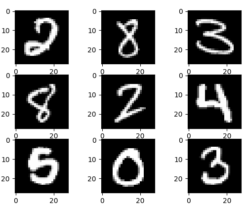
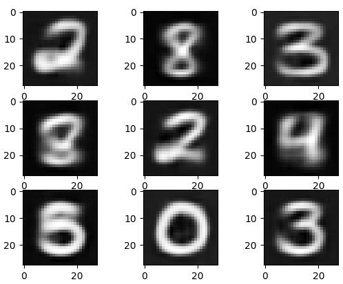
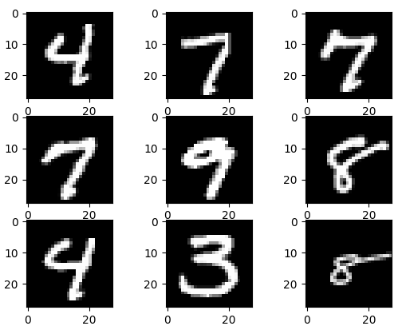
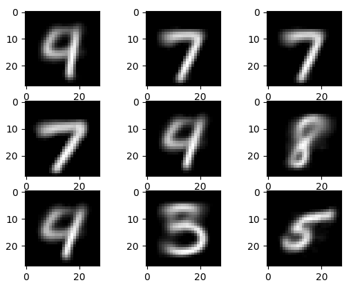
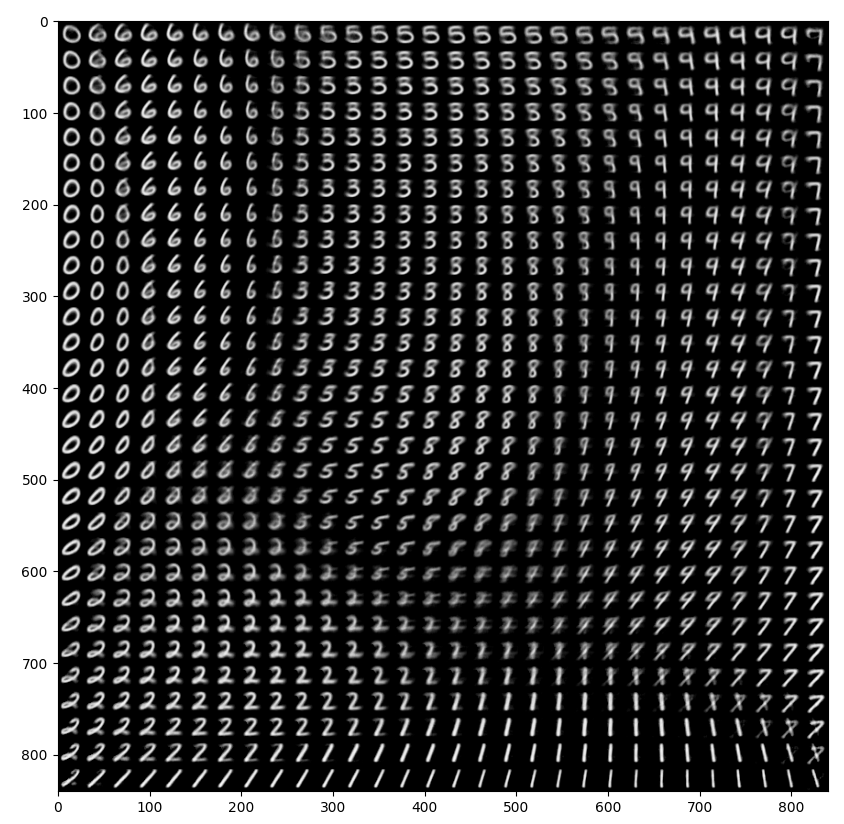
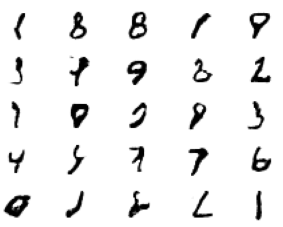

# MNIST
Using supervised and unsupervised machine learning techniques to classify the MNIST dataset

<h2>Convolutional Network</h2>

  
This network is able to read ~94% accuracy using image augmentation and L2 regularization

<h2>Autoencoder</h2>

  
Real Images
                               
   

  
Reconstructed Images

  

<h2>Variational Autoencoder</h2>

  
Real Images
                               
   

  
Reconstructed Images

  

  
Images Map

  

<h2>GAN</h2>

  
Generated Images
                               
   

